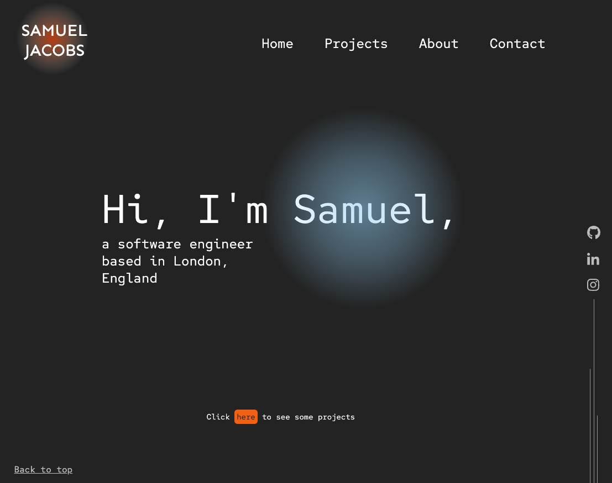

# Portfolio Website by Samuel Jacobs

## Project Overview
The purpose of this project was to develop fundamental software engineering skills while developing the design for a portfolio website that could act as a place to store and demonstrate my work from the time spent as a Junior Software Engineer at Nology.

## Design Approach
The design of the portfolio website integrated skills including UX Design, Figma, HTML, CSS, SCSS, and JavaScript.

A wireframe was developed on Figma for both a mobile version and larger screen version of the website. Figma prototyping features were then integrated into the design to create a more accurate representation of how the website should look and function.

Taking a mobile first approach, a basic version of the website was developed using HTML and SCSS.

Once the basic required elements had been coded and given their fundamental styling, CSS media queries were implemeneted so the design could be adapted to larger screens.

Having utilised media queries to integrate responsiveness into the website, additional styling was added. To improve user expereince, user interaction validation was implemented using basic CSS hover animations to give the user feedback. JavaScript was used to add additional functionality to the website such as the expandable projects on the Project section, the mobile menu overlay, and the typewriter-style greeting on the homepage section.

## Links to project
### Figma Design
#### Figma Wireframe
[Wireframe on Figma](https://www.figma.com/file/eAVBqpDecxdD9fbMnKAJmI/Portfolio-Prototype?node-id=164%3A423)
#### Figma Interactive Prototype
[Mobile Interactive Prototype on Figma](https://www.figma.com/proto/eAVBqpDecxdD9fbMnKAJmI/Portfolio-Prototype?node-id=164%3A424&scaling=scale-down&page-id=164%3A423&starting-point-node-id=164%3A424)

[Tablet/Desktop Interactive Prototype on Figma](https://www.figma.com/proto/eAVBqpDecxdD9fbMnKAJmI/Portfolio-Prototype?node-id=113%3A383&scaling=scale-down&page-id=113%3A215&starting-point-node-id=113%3A383)
### Deployed Site
[Deployed Portfolio Website](https://samueljacobs98.github.io/portfolio-website/#home)
### GitHub Repo
[GitHub Repository](https://github.com/samueljacobs98/portfolio-website)